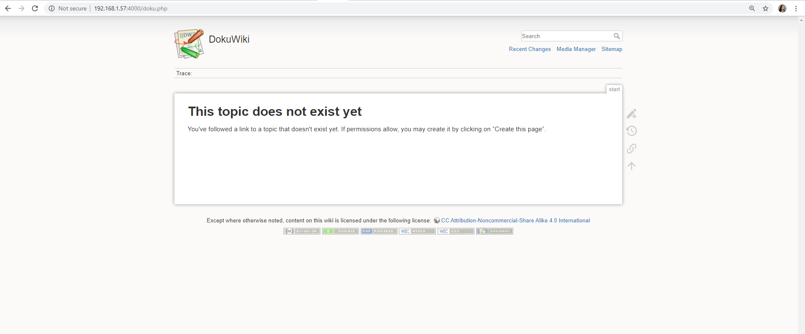

#### DokuWiki application deployment for DevOps course project

##### Application - DokuWiki

* Written on PHP
* Flat-file database

* Application was deployed on CentOS Linux release 7.6.1810 (Core), ip address: 192.168.1.57

* [Jenkinsfile](./Jenkinsfile)

* [Dockerfile](./Dockerfile)

* Jenkins pipeline:

* Jenkins pipeline parameters:

* [Jenkins console output](./jenkins_console_output.md)
 
* Slack notifications:

* Dockerhub [repository](https://cloud.docker.com/repository/list):

* DokuWiki UI:

